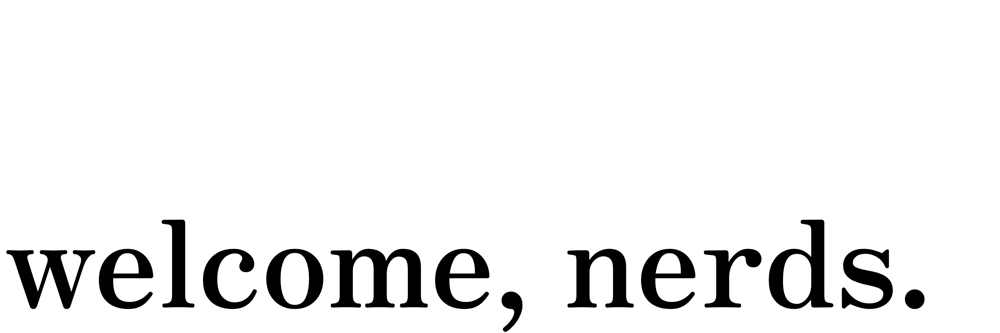

Hey! My name is Emma 👋🏼. I am a young software engineer passionate about building tools that affect people for the better. I currently work at [Hugo Health](https://hugo.health) building technology that helps people better access their medical data, and improve the data collection process that drives innovative research.

<h3><i>ask me about</i></h3>

🏠 Columbus, OH → Rochester, NY → Arlington, VA → Bloomington, IN

🎓 Bachelors in Computer Science from the <a href="https://www.cs.rochester.edu">University of Rochester</a>, focused in <a href="https://en.wikipedia.org/wiki/Human–computer_interaction">Human-Computer Interaction</a>.

💼 Working at <a href="https://hugo.health">Hugo Health</a>

<h3><i>my tools</i></h3>

  
  
  
  
  
  
  
  
  
  
  
  
  
  
  
  
  
  

